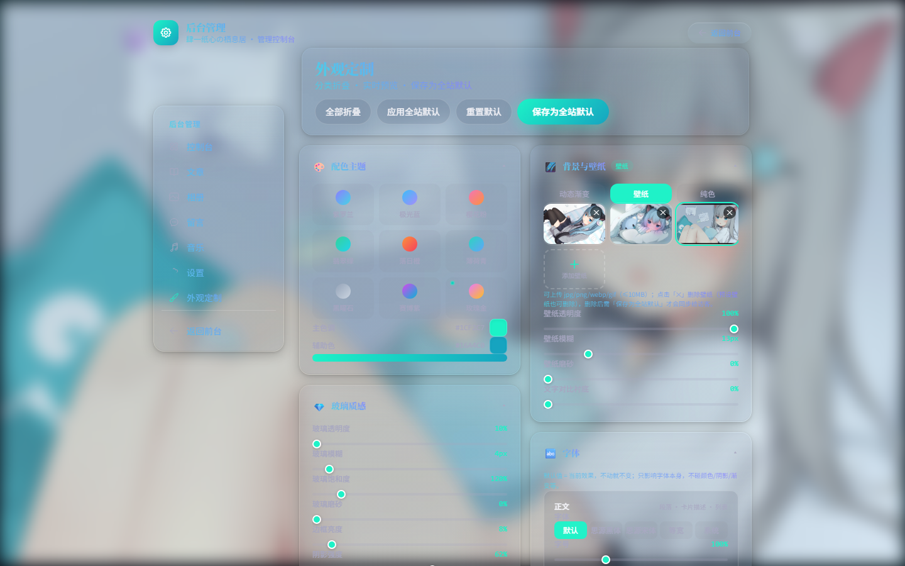
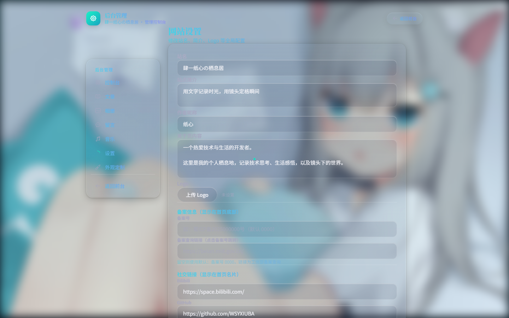

# 🚀 部署指南

> 肆一纸心の栖息居 —— 从零部署完整教程
> 适用系统：**Ubuntu / Debian / CentOS / 宝塔面板 / Docker / Windows**
> 部署方式任选其一，推荐 **方案一（Ubuntu + PM2）** 或 **方案三（Docker）**。

---

## 目录

1. [准备工作](#1-准备工作)
2. [方案一：Ubuntu / Debian + PM2（推荐）](#方案一ubuntudebian--pm2推荐)
3. [方案二：宝塔面板（新手友好）](#方案二宝塔面板新手友好)
4. [方案三：Docker（任意系统）](#方案三docker任意系统)
5. [方案四：Windows 服务器](#方案四windows-服务器)
6. [域名解析 + HTTPS + 备案](#6-域名解析--https--备案)
7. [数据备份与迁移](#7-数据备份与迁移)
8. [部署完成检查清单](#8-部署完成检查清单)
9. [常见问题 FAQ](#9-常见问题-faq)
10. [更新升级](#10-更新升级)

---

## 1. 准备工作

### 服务器要求

| 项目 | 最低要求 | 建议 |
|---|---|---|
| CPU / 内存 | 1 核 1G | 2 核 2G（腾讯云轻量/阿里云轻量均可） |
| 系统 | Ubuntu 22.04 / Debian 12 / CentOS 9 / Windows 10+ | Ubuntu 22.04 |
| 磁盘 | 10G | 20G+ |
| Node.js | ≥ 20 | 20 LTS |
| 域名 | 国内服务器需已备案 | 详见[第 6 节](#6-域名解析--https--备案) |

### 获取代码

```bash
git clone https://github.com/WSYXIUBA/LuminaNote.git
cd LuminaNote
```

### 部署成功后的效果预览

部署完成、打开网站后，应该和下面一致（默认外观 = 作者当前参数，开箱即用）：

| 前台首页 | 前台音乐页 | 后台控制台 |
|---|---|---|
|  |  |  |

| 后台外观定制 | 后台网站设置 | 后台文章管理 |
|---|---|---|
|  |  |  |

> 完整截图见 README「[效果预览](README.md#-效果预览)」章节：前台 6 页 + 后台 7 页。
> 部署成功后：壁纸背景、青绿主题、渐变文字、网易云歌单（7 个）都应正常显示；
> 相册/文章为空属正常（初始状态），后台添加后即显示。

---

## 方案一：Ubuntu / Debian + PM2（推荐）

### ① 安装 Node.js 20（nvm 方式）

```bash
# 安装 nvm
curl -o- https://raw.githubusercontent.com/nvm-sh/nvm/v0.40.1/install.sh | bash
source ~/.bashrc

# 安装 Node 20
nvm install 20
nvm alias default 20
node -v   # 应输出 v20.x
```

### ② 安装依赖

```bash
cd LuminaNote
npm install
```

### ③ 配置环境变量

```bash
cp .env.example .env
nano .env
```

`.env` 内容说明：

```bash
# SQLite 数据库文件（相对 prisma/ 目录）
DATABASE_URL="file:./dev.db"

# 管理员账号（首次 seed 时创建）
ADMIN_USERNAME="admin"
# ★ 务必改成你自己的强密码
ADMIN_PASSWORD="换成强密码"

# ★ 会话签名密钥，务必改成随机串
JWT_SECRET="openssl rand -base64 32 生成"
```

> 生成随机密钥：`openssl rand -base64 32`

### ④ 初始化数据库

```bash
# 创建数据库表
npx prisma migrate deploy

# 写入默认数据（站点设置 + 默认外观配置 + 管理员账号）
npx prisma db seed
```

> 默认数据即作者当前使用的参数：壁纸背景（青绿主题）、渐变文字、
> 极光涟漪点击特效、音乐光效、7 个网易云歌单等，部署后开箱即用，
> 之后可在后台「外观定制 / 网站设置」自由修改。

### ⑤ 构建并启动

```bash
npm run build
npm run start        # 临时启动，验证 http://服务器IP:3000
```

### ⑥ 用 PM2 守护进程（推荐）

```bash
npm install -g pm2

# 启动
pm2 start npm --name habitat -- start

# 开机自启（执行后按提示运行输出的命令）
pm2 startup
pm2 save

# 常用命令
pm2 status          # 查看状态
pm2 logs habitat    # 查看日志
pm2 restart habitat # 重启
```

### ⑦ Nginx 反向代理 + HTTPS

见[第 6 节](#6-域名解析--https--备案)。

---

## 方案二：宝塔面板（新手友好）

### ① 安装宝塔

```bash
# 官方安装脚本（Ubuntu/Debian/CentOS 通用）
wget -O install.sh https://download.bt.cn/install/install_6.0.sh && bash install.sh
```

安装完成后用面板地址 + 账号登录。

### ② 安装运行环境

宝塔面板 → **软件商店** → 安装：
- **PM2 管理器**（自带 Node.js，选 20.x）
- **Nginx**（1.22+）
- 无需安装数据库（本项目的 SQLite 是文件型）

### ③ 上传代码

宝塔面板 → **文件** → 进入 `/www/wwwroot/` → 上传代码压缩包并解压，
或使用「终端」执行 `git clone`。

### ④ 配置 .env

宝塔面板 → **文件** → 编辑 `.env`（先 `cp .env.example .env`），
参照[方案一第 ③ 步](#③-配置环境变量)修改 `ADMIN_PASSWORD` 与 `JWT_SECRET`。

### ⑤ 初始化数据库 + 构建

宝塔面板 → **终端**（或 SSH）：

```bash
cd /www/wwwroot/LuminaNote
npm install
npx prisma migrate deploy
npx prisma db seed
npm run build
```

### ⑥ 添加 Node 项目

宝塔面板 → **网站 → Node 项目 → 添加 Node 项目**：

| 配置项 | 值 |
|---|---|
| 项目目录 | `/www/wwwroot/LuminaNote` |
| 启动选项 | `npm` |
| 启动参数 | `run start` |
| 端口 | `3000` |

### ⑦ 绑定域名 + SSL

宝塔面板 → **网站 → Node 项目 → 设置**：
- **域名管理**：绑定你的域名
- **SSL**：申请 Let's Encrypt 免费证书并开启强制 HTTPS
- 面板会自动生成 Nginx 反向代理配置，无需手动编辑

---

## 方案三：Docker（任意系统）

> 适合 Docker 已装好的服务器（Ubuntu/CentOS/Windows 均可）。

### ① 安装 Docker（如未安装）

```bash
# Ubuntu/Debian
curl -fsSL https://get.docker.com | bash
systemctl enable --now docker

# 安装 Compose 插件
apt install -y docker-compose-plugin
```

### ② 构建并启动

```bash
cd LuminaNote

# 构建镜像 + 后台启动
docker compose up -d --build

# 初始化数据库（首次必做）
docker compose exec habitat npx prisma migrate deploy
docker compose exec habitat npx prisma db seed
```

### ③ 验证

浏览器访问 `http://服务器IP:3000`。

### ④ 常用命令

```bash
docker compose ps                 # 状态
docker compose logs -f habitat    # 日志
docker compose restart            # 重启
docker compose down               # 停止（数据保留在 ./data 和 ./uploads）
```

### ⑤ 数据持久化说明

| 宿主机目录 | 容器目录 | 内容 |
|---|---|---|
| `./data` | `/app/data` | SQLite 数据库 dev.db |
| `./uploads` | `/app/uploads` | 后台上传的文件 |

> 修改默认管理员密码：编辑 `docker-compose.yml` 里的
> `ADMIN_PASSWORD` / `JWT_SECRET`，然后
> `docker compose up -d` 重建即可（密码在 seed 时生效）。

### ⑥ 反向代理

容器只暴露 3000 端口，生产环境建议在宿主机用 Nginx/Caddy
反代到 `http://127.0.0.1:3000`，配置见[第 6 节](#6-域名解析--https--备案)。

---

## 方案四：Windows 服务器

### ① 安装 Node.js

到 <https://nodejs.org> 下载 **LTS 版（20.x）** 安装包，一路下一步。
安装后在 PowerShell 验证：

```powershell
node -v
npm -v
```

### ② 部署代码

任选其一：
- **git**：`git clone https://github.com/WSYXIUBA/LuminaNote.git`
- **压缩包**：下载仓库 zip → 解压

### ③ 初始化

```powershell
cd LuminaNote
npm install
Copy-Item .env.example .env
# 编辑 .env：修改 ADMIN_PASSWORD 与 JWT_SECRET
npx prisma migrate deploy
npx prisma db seed
npm run build
```

### ④ 启动

```powershell
npm run start
```

浏览器访问 `http://localhost:3000`。

> 开机自启：用 NSSM 把 `npm run start` 注册为 Windows 服务：
> `nssm install habitat "C:\Program Files\nodejs\npm.cmd" "run start"`

### ⑤ 外网访问

- 服务器防火墙放行 3000 端口（或改用 IIS/nginx 反代 80 端口）
- 域名解析 + HTTPS 见[第 6 节](#6-域名解析--https--备案)

---

## 6. 域名解析 + HTTPS + 备案

### ① 域名解析

在域名服务商（腾讯云 DNSPod / 阿里云等）添加记录：

| 类型 | 主机记录 | 记录值 |
|---|---|---|
| A | `@` | 服务器公网 IP |
| A | `www` | 服务器公网 IP |

### ② Nginx 反代配置（方案一/三/四通用）

```bash
# Ubuntu：apt install -y nginx
nano /etc/nginx/sites-available/habitat
```

```nginx
server {
    listen 80;
    server_name 你的域名.com www.你的域名.com;

    location / {
        proxy_pass http://127.0.0.1:3000;
        proxy_http_version 1.1;
        proxy_set_header Host $host;
        proxy_set_header X-Real-IP $remote_addr;
        proxy_set_header X-Forwarded-For $proxy_add_x_forwarded_for;
        proxy_set_header X-Forwarded-Proto $scheme;
        proxy_set_header Upgrade $http_upgrade;
        proxy_set_header Connection "upgrade";
        proxy_read_timeout 300s;
    }

    # 上传文件（图片/视频）走本地，不占 Node 进程
    location /uploads/ {
        proxy_pass http://127.0.0.1:3000;
        proxy_set_header Host $host;
    }
}
```

```bash
ln -s /etc/nginx/sites-available/habitat /etc/nginx/sites-enabled/
nginx -t && systemctl reload nginx
```

### ③ HTTPS 免费证书（certbot）

```bash
apt install -y certbot python3-certbot-nginx
certbot --nginx -d 你的域名.com -d www.你的域名.com
# 自动续期
certbot renew --dry-run
```

### ④ 国内服务器备案

国内服务器（腾讯云/阿里云等）**必须备案**后才能用域名访问 80/443 端口：

1. 云厂商控制台 → **ICP 备案** → 提交备案信息（身份证、幕布拍照等）
2. 备案审核一般 7~20 个工作日
3. 备案通过后，在后台 **网站设置 → 备案信息** 填写备案号
4. 前台首页底部会自动显示备案号，点击可跳转工信部查询

> 备案期间可先用 `http://服务器IP:3000` 访问。

---

## 7. 数据备份与迁移

### 需要备份的东西（全部是文件，直接复制即可）

| 内容 | 路径 |
|---|---|
| SQLite 数据库 | `prisma/dev.db` |
| 上传文件 | `uploads/` 整个目录 |

### 一键备份脚本（Ubuntu）

```bash
# backup.sh
#!/bin/bash
DATE=$(date +%Y%m%d)
tar -czf habitat-backup-$DATE.tar.gz \
  prisma/dev.db \
  uploads
echo "备份完成：habitat-backup-$DATE.tar.gz"
```

恢复：解压后放到对应位置，重启服务即可。

### 迁移到新服务器

1. 新服务器按本教程部署好（初始化数据库）
2. 用备份的 `dev.db` 覆盖新服务器的 `prisma/dev.db`
3. 用备份的 `uploads/` 覆盖新服务器的 `uploads/`
4. 重启服务

---

## 8. 部署完成检查清单

部署后按以下清单逐项确认，全部 ✓ 即部署成功：

- [ ] 打开 `http://服务器IP:3000` 看到首页（毛玻璃卡片 + 壁纸背景）
- [ ] 首页底部显示版权行 + 备案号（默认 `0000`，备案后到后台填写真实编号）
- [ ] 音乐页能显示网易云歌单（7 个默认歌单）
- [ ] `/admin` 能登录（`admin` / `.env` 里设置的密码）
- [ ] 后台 → 外观定制：能调节参数，点「保存为全站默认」后刷新前台生效
- [ ] 后台 → 网站设置：改站名/简介/备案号后前台立即生效
- [ ] 后台上传一张图片 → 前台能正常显示（`uploads/` 可写）
- [ ] 日志无报错：`pm2 logs habitat`（PM2）或 `docker compose logs habitat`（Docker）

> 若某项不通过，优先看 FAQ 对应条目。

---

## 9. 常见问题 FAQ

### Q1：忘记管理员密码？

```bash
# 删除数据库中的管理员记录，然后重新 seed
npx prisma db seed
```

> seed 只在「无管理员」时创建管理员，密码取 `.env` 的 `ADMIN_PASSWORD`。

### Q2：`npm install` 时 sharp 安装失败？

```bash
# 清理后重装
rm -rf node_modules package-lock.json
npm install
# 或单独修复
npm rebuild sharp
```

### Q3：上传图片后显示 404？

- 确认 `uploads/` 目录存在且有写权限：`chmod -R 755 uploads`
- Docker 部署确认 `./uploads` 卷已挂载

### Q4：网易云歌单加载不出来？

- 网易云部分接口有防盗链/地区限制，可在后台把歌单换成自己收藏的歌单 ID
- 或改用后台「音乐列表」直接填音频文件 URL

### Q5：端口 3000 被占用？

```bash
# 换端口启动
PORT=3100 npm run start
```

### Q6：部署后打开是默认外观，改过的配置丢了？

- 前台调的效果只存在**当前浏览器**（localStorage）
- 要让全站生效：后台 → **外观定制** → 调好后点顶部「**保存为全站默认**」
- 该配置写入数据库 `effects_config`，所有新访客都会应用

### Q7：SQLite 数据库权限问题（Permission denied）？

```bash
chmod -R 755 prisma uploads
```

---

## 10. 更新升级

```bash
cd LuminaNote

# 拉取最新代码
git pull

# 装依赖 + 构建
npm install
npm run build

# 重启
pm2 restart habitat            # PM2 方式
docker compose up -d --build   # Docker 方式
```

---

> 📌 有任何问题欢迎在 GitHub Issues 提出。
