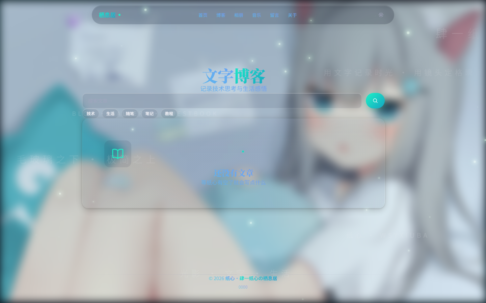
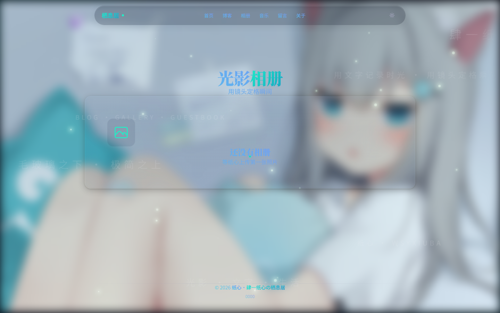
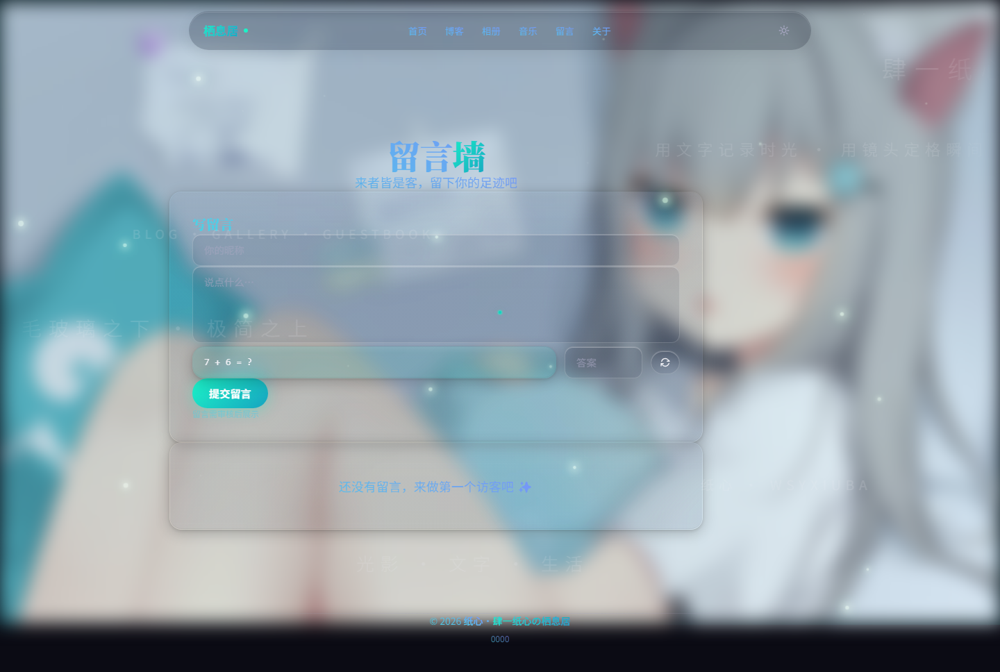
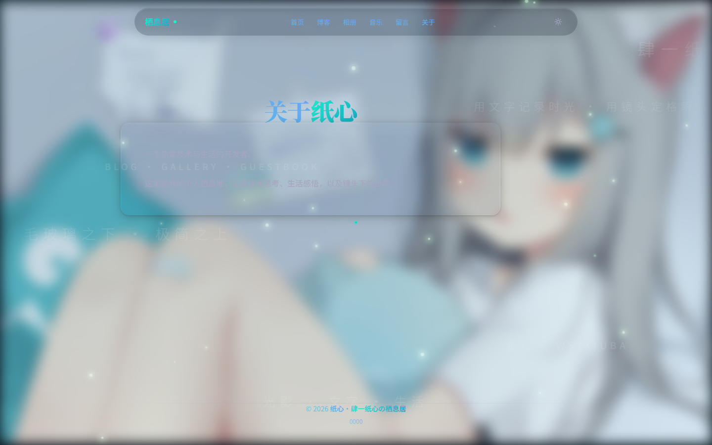
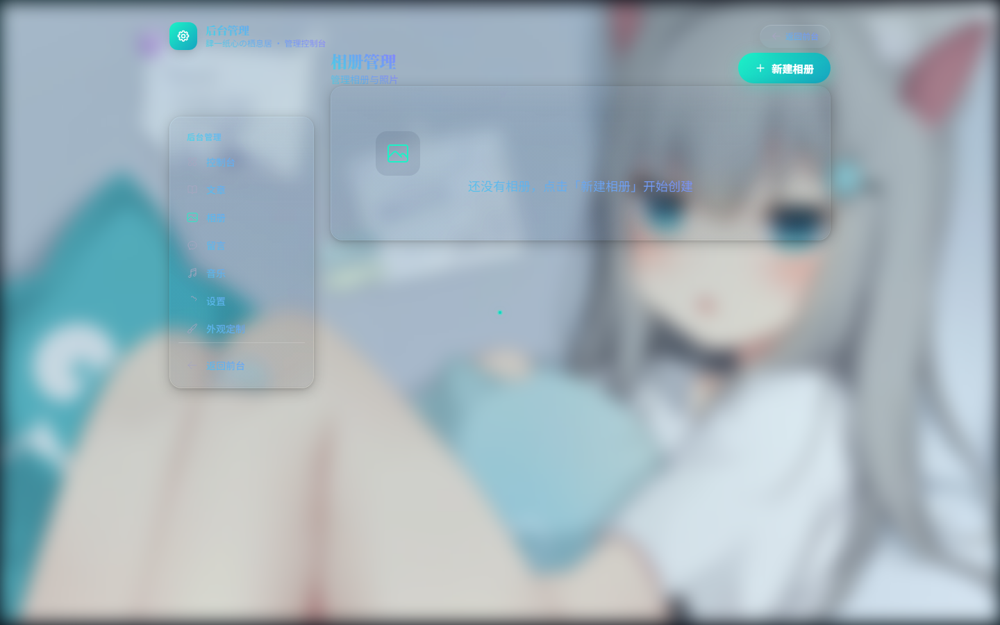
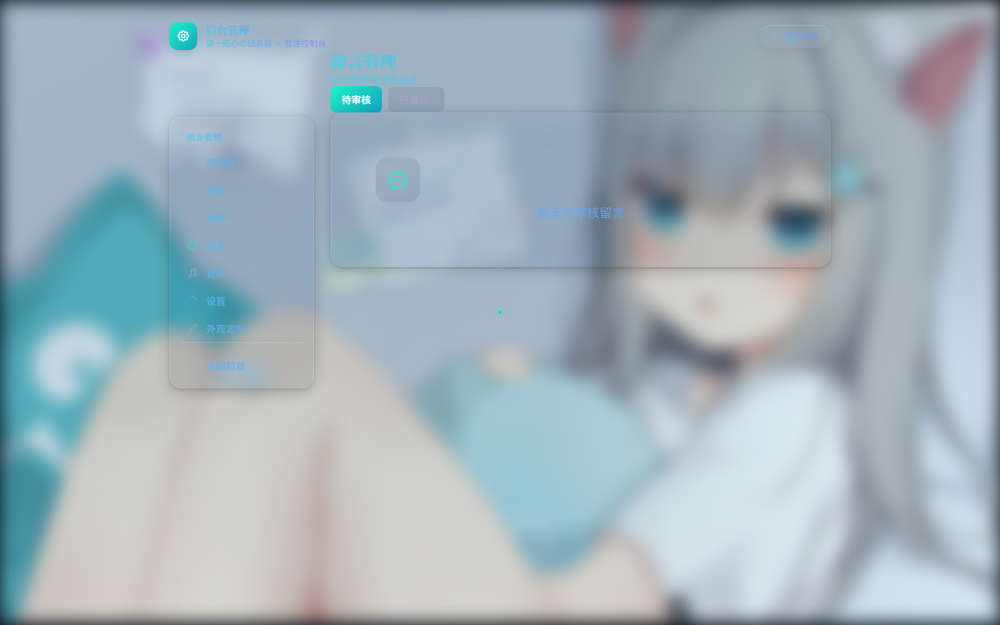
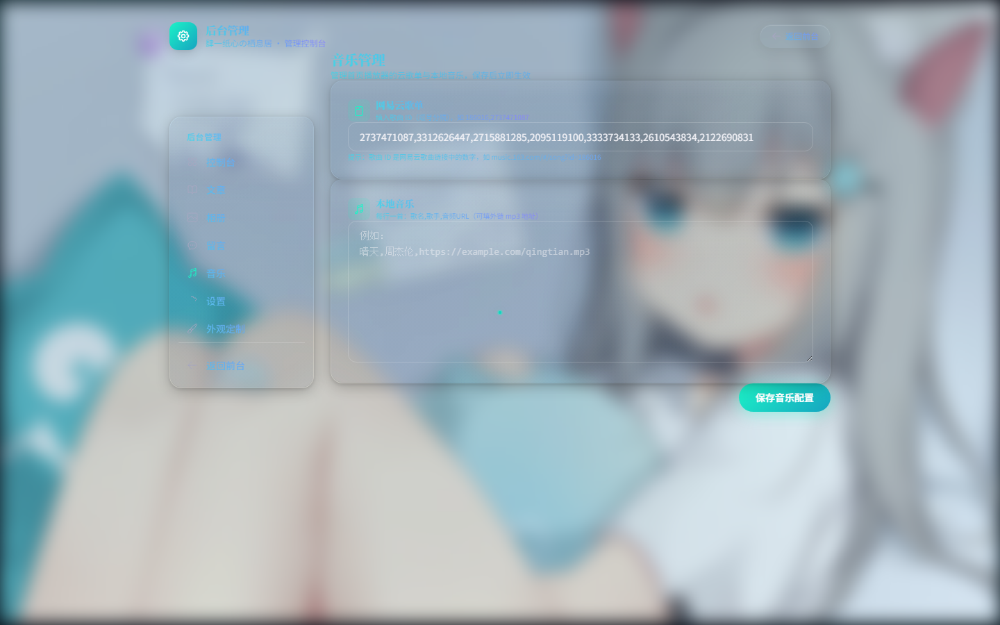

# 肆一纸心の栖息居


个人网站全栈项目 —— 博客 + 相册 + 留言墙 + 自建统计 + 后台管理，毛玻璃极简设计，附带可配置的沉浸式背景特效（雨幕 / 萤火虫 / 樱花 / 点击涟漪等）。

项目所有者：纸心（GitHub: [WSYXIUBA](https://github.com/WSYXIUBA)）

## ✨ 效果预览

### 前台

| 首页 | 博客 | 相册 |
|---|---|---|
|  |  |  |

| 音乐 | 留言墙 | 关于 |
|---|---|---|
|  |  |  |

> 截图均为部署后真实效果（壁纸背景 + 青绿主题 + 渐变文字 + 网易云歌单）。相册/文章为空为初始状态，后台添加后即显示。

### 后台管理（/admin）

| 控制台 | 外观定制 | 网站设置 |
|---|---|---|
|  |  |  |

| 文章管理 | 相册管理 | 留言管理 | 音乐管理 |
|---|---|---|---|
|  |  |  |  |

## 技术栈

| 层 | 选型 |
|---|---|
| 框架 | Next.js（App Router）+ TypeScript |
| 样式 | Tailwind CSS（含暗色模式） |
| 数据库 | SQLite + Prisma ORM |
| 图片 | 本地存储（uploads/）+ sharp 缩略图 |
| 认证 | 自写 session（cookie）+ JWT 签名，单管理员账号 |
| 验证码 | 算术题验证码（零依赖） |
| 统计 | 自建埋点（PV/UV/文章热度），数据落 SQLite |
| Markdown | remark + rehype 管线，代码高亮 |

## 功能

**前台**
- 首页：最新文章 + 热门文章 + 站点简介（后台可改）
- 博客：分页、分类/标签筛选、关键词搜索、年月归档、Markdown 渲染 + TOC + 代码高亮、浏览量、上下篇导航
- 相册：瀑布流分组、灯箱预览（左右切换 / ESC 关闭）
- 留言墙：匿名留言 + 算术验证码，审核后展示
- 关于页：内容后台可编辑
- 音乐页：云音乐歌单 / 自定义音频列表
- 全局：明暗主题切换、移动端响应式、底部备案号（后台可配，点击跳转备案查询）

**后台（/admin）**
- 控制台：今日/昨日/总 PV、UV 卡片，近 30 天趋势，热门文章 Top10
- 文章 / 相册 / 留言（审核）/ 音乐 管理
- 网站设置：站名、简介、关于页、Logo、社交链接、备案号与备案链接 —— 保存后前台立即生效
- 外观定制：背景模式（渐变/纯色/壁纸）、字体（分分类缩放/字重）、文字颜色（单色/渐变/透明叠加 + 发光/浮雕/玻璃/模糊等 13 项控件）、毛玻璃参数、点击特效风格、雨幕、萤火虫、樱花等全套特效参数

**特效（可后台开关与调参）**
- 雨幕：水滴透镜折射、水流、雾气凝结恢复
- 点击特效：光波矩阵 / 丝滑水波（纯折射扭曲）/ 晶钻星芒 / 星辰飞溅 / 心动光尘 / 琉璃气泡
- 氛围：萤火虫（可随音乐律动）、樱花、光标拖尾、头像光晕、卡片倾斜

## 快速开始

环境要求：Node.js ≥ 20，npm ≥ 10。

```bash
# 1. 安装依赖
npm install

# 2. 配置环境变量
cp .env.example .env
#   编辑 .env：务必修改 ADMIN_PASSWORD 与 JWT_SECRET

# 3. 初始化数据库并写入默认数据
npx prisma migrate dev --name init
npx prisma db seed   # 或 npm run db:seed

# 4. 开发模式
npm run dev          # http://localhost:3000

# 5. 生产模式
npm run build
npm run start
```

默认管理员：`admin` / 你在 `.env` 里设置的 `ADMIN_PASSWORD`。

> 💡 初始化后即为**作者默认外观**（壁纸背景 + 青绿主题 + 渐变文字 + 极光涟漪点击 + 音乐光效 + 网易云歌单），开箱即用。
> 默认配置见 `prisma/defaults/effects-config.json`，部署后可在后台随时修改。

## 目录结构

```
src/
  app/           # 路由（前台 + 后台 /admin + API /api）
  components/
    effects/     # 背景与点击特效（雨幕、涟漪、萤火虫等）
    layout/      # 站点外壳、后台布局
    ui/          # 通用组件
    home/        # 首页组件
  lib/           # 数据库、认证、特效状态、Markdown 渲染等
prisma/
  schema.prisma  # 数据模型
  seed.ts        # 默认数据（站点设置 + 外观配置 + 管理员）
  defaults/      # 默认配置 JSON（effects-config.json）
public/
  wallpapers/    # 内置壁纸
uploads/         # 用户上传文件（运行时生成，不入库）
```

## 部署

完整教程见 **[DEPLOY.md](DEPLOY.md)** —— 覆盖 Ubuntu + PM2 / 宝塔面板 / Docker / Windows 四种方式，含域名、HTTPS、备案、备份与 FAQ。

**Docker 一键起（最省事）：**

```bash
git clone https://github.com/WSYXIUBA/LuminaNote.git && cd LuminaNote
docker compose up -d --build
docker compose exec habitat npx prisma migrate deploy
docker compose exec habitat npx prisma db seed
# 访问 http://服务器IP:3000
```

**裸机部署（Ubuntu 示例）：**

```bash
npm ci
cp .env.example .env   # 修改 ADMIN_PASSWORD 与 JWT_SECRET
npx prisma migrate deploy
npx prisma db seed
npm run build
npm run start          # 建议 pm2 / systemd 守护
```

> 数据文件：SQLite 在 `prisma/dev.db`，上传文件在 `uploads/`，备份复制这两处即可。
